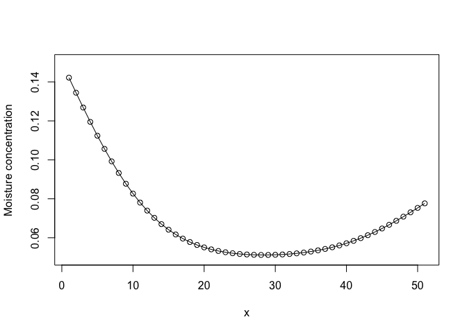
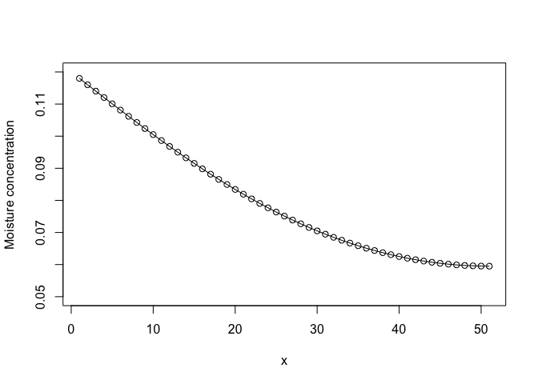

# **Rdiffsolver**

Like its name implies, *Rdiffsolver* is an R package 
with many functions used for solving the diffusion equation. 
I wrote these functions first in MATLAB, and I ported them 
to R so that I can use it anywhere without 
having to install MATLAB nor paying its license (quite 
expensive, seriously).

This package, as you can clearly see, is still 
in development. In the future, I'll translate more 
and more of the codes that I have written in MATLAB 
to R and add more functionalities to this package. 
Expect to have some additional features, such as:

+ non-uniform initial condition,
+ nonlinear diffusion, or concentration-dependant coefficient of diffusion,
+ estimating the coefficient of diffusion based on experimental data through curve-fitting,
+ many others.

If you have any advice, inputs, 
or even if you want to contribute, 
please don't hesitate to contact me at 
[ahmad.alkadri@outlook.com](mailto:ahmad.alkadri@outlook.com). 
Many thanks!
=======
Rdiffsolver
================

[](https://travis-ci.org/ahmad-alkadri/Rdiffsolver)

Like its name implies, *Rdiffsolver* is an R package useful for solving
the diffusion equation. It was originally written during the early stage
of my Ph.D. as a collection of MATLAB functions, all designed with a
single goal in mind: to help me working with my Ph.D. thesis, which aims
to characterize the vapor moisture transport in wood, in a manner as
simple and as fast as possible.

## Background

When I first wrote the functions that would become the basis for this
package, my goal was simple: to solve unidimensional diffusion, with
constant coefficient of diffusion (*D*), rapidly with numerical method.
A unidimensional diffusion can be expressed as the following partial
differential equation:

``` r
# dC/dt = d/dx(D*dC/dx)
```

where *x* is the direction of the diffusion (in this case, because it is
unidimensional, we only use one axis, and in this case, *x*), *t* is the
time, and *C* is the diffusing concentration.

The diffusion equation is well-known as quite hard to solve
analytically, even in its unidimensional form, and various papers and
books have been dedicated on this. Numerical solutions are thus
preferred for large and complex system. Because I’m working with wood,
and because I knew back then that I would need to ‘scale up’ my
functions from one towards two- and three-dimensions, I thus decided to
write these functions to solve the diffusion equation using numerical
methods.

## Methods

I’ve looked up to various different methods for doing that, and my first
choice fell on finite difference, particularly the implicit method.
There are various reasons for that, but basically, it all fell on three
specific things:

  - it is stable, which actually is the most important thing here,
  - it is relatively fast,
  - it is easy to reproduce the functions.

## Applications and Boundaries

Because I stressed on the simplicity and applicability, there are many
limitations in this package for now. The fonctions work if you want to
solve a diffusion equation *in* a one-dimensional slab with a length
*L*. Further, I have only implemented in here two kinds of boundary
conditions: dirichlet on both side and dirichlet one one side *and*
neumann on another side with zero flows.

### Case 1: Dirichlet on both sides

Let us have a wooden slab which sides, all of them except two facing
parallel to each other, are insulated perfectly so that no kind of
diffusion could happen except through the two faces parallel to each
other.

Let’s say the length of this slab, or the distance between the two
parallel faces, is 5 mm. We impose a moisture concentration on one face
of the slab as 8%, and the other side as 15%. We measured the initial
moisture concentration of the slab as 5%, and the coefficient of
diffusion of the slab as 0.005 mm<sup>2</sup>/s.

If we let the concentration from the side to diffuse into the slab for,
let’s say, 1000 s, what is the concentration profile at *t* = 100 s?

**Answer:**

``` r
library(Rdiffsolver)
Lx <- 5 #Length of the slab, in mm
Tt <- 1000 #Total measured diffusion time in seconds
nt <- 10000 #Number of time discretization
nx <- 50 #Number of space discretization
D <- 0.005 #Coefficient of diffusion
C_ini <- 0.05 #Initial concentration in the slab
C_lim <- c(0.08,0.15) #Dirichlet boundary condition imposed on the two faces

#Solving
matC <- diff.1D(Lx, Tt, nt, nx, D, C_ini, C_lim)
```

    ## [1] "Boundary conditions: dirichlet in both sides"

``` r
t_q <- 100 #questioned time

#plot the result
plot(c(1:51),matC[,t_q/Tt*nt], xlab = "x", ylab = "Moisture concentration", ylim=c(C_ini,max(C_lim)))
lines(c(1:51), matC[,t_q/Tt*nt])
```

<!-- -->

### Case 2: Dirichlet on one side, neumann with zero flow on another

Now for the second case, let us take the previous slab, but now, instead
of having two “open” sides, let’s close one of them completely, seal it
perfectly so there is no concentration exchange could occur from the
slab at that side.

So now let’s suppose that, in this slab, the initial moisture
concentration is 5% again. Now we impose a moisture concentration on the
only open face of the slab as 12%. We’ll use the same coefficient of
diffusion of the slab, which is 0.005 mm<sup>2</sup>/s.

If we let the concentration from the side to diffuse into the slab for
1000 s too, what is the concentration profile at *t* = 750 s?

**Answer:**

``` r
library(Rdiffsolver)
Lx <- 5 #Length of the slab, in mm
Tt <- 1000 #Total measured diffusion time in seconds
nt <- 10000 #Number of time discretization
nx <- 50 #Number of space discretization
D <- 0.005 #Coefficient of diffusion
C_ini <- 0.05 #Initial concentration in the slab
C_lim <- 0.12 #Dirichlet boundary condition imposed on one face

#Solving
matK <- diff.1D(Lx, Tt, nt, nx, D, C_ini, C_lim)
```

    ## [1] "Boundary condition: dirichlet in one side and newmann in another"

``` r
t_q <- 750 #questioned time

#plot the result
plot(c(1:51),matK[,t_q/Tt*nt], xlab = "x", ylab = "Moisture concentration", ylim=c(C_ini,C_lim))
lines(c(1:51), matK[,t_q/Tt*nt])
```

<!-- -->

## Future Works

This package, as you can clearly see, is still developing In the future,
I’ll translate more and more of the codes that I have written to R and
add more functionalities to this package. Expect to have some additional
features, such as:

  - Neumann boundary conditions with non-zero flow value
  - Combination of dirichlet and neumann boundary conditions
  - Non-uniform initial condition
  - Nonlinear diffusion, or concentraion-dependant coefficient of
    diffusion
  - many others.

If you have any advice, inputs, or even if you want to contribute,
please don’t hesitate to contact me at <ahmad.alkadri@outlook.com>. Many
thanks\!
>>>>>>> master
